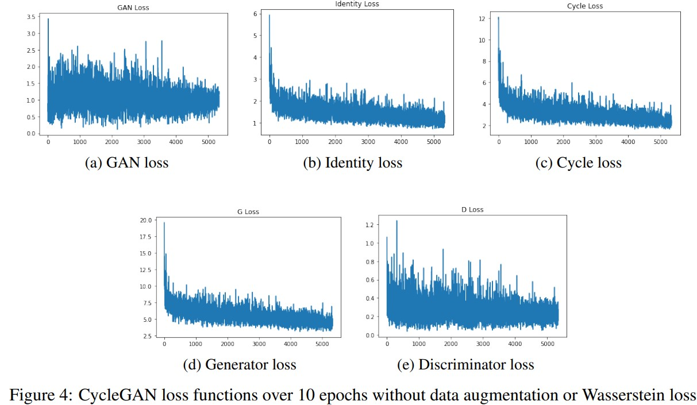

# CycleGAN-in-PyTorch
Implement CycleGAN in PyTorch with optional Wasserstein loss on Ukiyo-e Dataset
## Introduction
This is a CycleGAN implementation with PyTorch.
Baseline method on Horse2Zebra dataset.
```
baseline.ipynb
```
Training script
```
wgan.ipynb
```
Testing script
```
test.ipynb
```
### Results 
 
 
 
